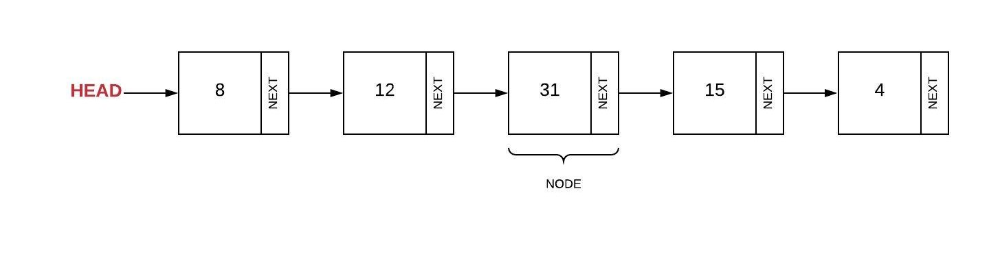

# Linked Lists

## Introduction
Before we get too deep into what this data structure is, we first need to learn a little program ancestry.

Python is a descendant of C. The C language, in case you are not familiar, uses pointers. A pointer is a variable that stores the physical address of another variable in memory. That is the basic explanation of a pointer. Feel free to go to the following link to learn a lot more: [https://mppolytechnic.ac.in/mp-staff/notes_upload_photo/CS52024-03-2020.pdf](https://mppolytechnic.ac.in/mp-staff/notes_upload_photo/CS52024-03-2020.pdf)

Now that we basically know what a pointer is, we can say that a linked list is simply a list that is connected via pointers.

This is good because it gives us O(1) performance, which is the best possible performance available!

## What is a Linked List?
A linked list is called such because of how it is put together. There is no organization in terms of the values being stored in the python list. Linked lists are connected to the next element in the list via pointers.

Let's look at some diagrams to help us understand what it is we are actually talking about here.

Here is a diagram of a single linked list:

Notice that in the above diagram, there is a head, which is always the start of the list, some boxes with values, and arrows pointing one way to the last box. It's not pictured here, but after the last box is the tail. Again, **each linked list has a head and a tail.** Each box is called a **node**. In this example, each **node** has a **next**. You can only go one way with this single linked list, just like a one way road.

Here is a diagram of a double linked list:

In this example, notice the difference here. There are the arrows starting at the head, going from left to right, all the way to the tail,  but there's also arrows pointing right to left from tail to head. That is what makes this a **double linked list**. This is just like your typical road that allows for cars to travel both ways.

Unlike a queue, which can only be added to the back and removed from the front, a linked list can be added or removed from anywhere!

In order to accomplish this, there are a few steps that must be done in order for the expected outcome to actually occur.

To remove the first node from the head:

Notice in the above picture from double linked lists, there's an arrow from the head pointing to the right. That very arrow first needs to go to the second node which will become the first. The reason why we do this first, is because the first node will remain there. If we did this step any other time than first, then we will effectively lose the node and then we cannot complete what we want to do.

The step after that would be to have the second nodes previous to disapper. To do that, we would simply say that it is equal to **None**.

The last step would be to get rid of the last arrow of the first node, which we would also equal to **None**. With all of those steps done, the original second node is now the first!

Seem confusing, don't worry. We're going to look at this in code right now.

## Programming Examples
Here's how writing the code to get rid of the first node will look like:

```python
    curr = List() # Curr will be the current node 
    # (in this case the first node) from the List class
    
    # This is Step 1: We want the head to connect to the second nodes previous
    self.head = curr.next.prev

    # Now for Step 2: We want to get rid of the second nodes prev
    curr.next.prev = None

    # Step 3 is now to get rid of the last arrow which looks like this:
    curr.next = None

```
That's it! Now we're done! The original second node is now the first node and the original first has been removed from the list. **It has not been deleted!** It has only been removed. Note that each of these lines of code are assignment operators which we know to be O(1).

Now what about removing or adding in the middle or the end of a linked list? For the adding rather at the front or the end, the process is the same.

In order to add or remove from a linked list, it has one extra step. Not that bad. Although, it is a bit more involved. To really understand how to do that and why to do it in a specific order, check out this link: [https://www.geeksforgeeks.org/linked-list-set-2-inserting-a-node/](https://www.geeksforgeeks.org/linked-list-set-2-inserting-a-node/)

They do a great job with pictures and explanations. Note that the assignment will have you add a node in the middle of a linked list, so you would need to visit the link in order to know how to accomplish that.

## Problem to Solve

For this problem, we are going to illustrate working with a linked list by using "train tracks". The goal of each problem is to write the functions necessary to complete the task, then to implement your solutions for each problem respectively.

The problem file is here: [linked_list_problem.py](linked_list_problem.py)

## Sample Solution

If you get stuck or finish the assignment, please feel free to look at a possible solution here: [linked_list_solution.py](linked_list_solution.py).
Again, if you ever get stuck or have questions, please email me so that I can help you understand better. Email is listed on the Welcome page.