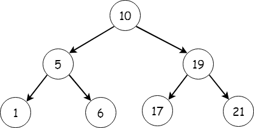

# Trees

## Introduction

To help you understand how trees work, we first understand recursion. This will be explained why later. To keep this module more concise, please review this link: [https://www.geeksforgeeks.org/recursion-in-python/](https://www.geeksforgeeks.org/recursion-in-python/). Once you finish that, then you can come back here to completel this module.

Trees can help keep what we store organized, especially if you're storing something like a list. The performance depends on the structure of the tree, which we'll go over soon, but for the most part, it's performance can be rather O(n) or O(log n). For best performance, we want the latter.

## What is a Tree?

A tree is similar to a linked list in that it is connected to nodes by pointers. However, ***trees*** can have nodes ***connect to multiple nodes***.

Let's look at the following picture:



Here, we see that the top node, known as the **root**, connects to 2 nodes, known as **leaves** one left, and one right. There is an order to this, and is not random, although it may seem that way at first glance. Can you tell what the order is? If not, don't worry about it. The root has a value of 10, then the left leaf has a value of 5, then the right with a value of 19. The pattern here is whatever value is **less than** the above node, then it goes to the **left**. Otherwise, it goes to the **right**. The pattern continues with the 5 node. 1 is less than 5, so it goes on the left, and 6 is greater than 5, so it goes on the right. This is called a Balanced Binary Tree, also known as a **Binary Search Tree (BST)**, which is inherently balanced.

Performance, wise, if the tree is structured like in the example picuted above, then you could achieve a performance level of O(log n) because you would not be searching every item. Otherwise, if it is structured in a way that the tree is essentially a linked list, (meaning that there is only one side), then that would be performance level of O(n) since you would be searching every item.

## Programming Examples
Knowing what you do about linked lists and now recursion, can you see why using recursion would be amazing to use if you were searching for the value 6?

Here's an example of what it might look like **without recursion**:
```python
    while root is not None:
        if node.value == leaf.left:
            print('Found it')
        elif:
            node.value == leaf.right:
            print('Found it')
        else:
            print("Guess it's not here?")
    print('Found the end')
```
Keep in mind that would **only** search the left half of the tree going as deep as one leaf in. You would have to repeat that over and over again for not just the right half of the tree, but going further down the structure. What if your tree had 1,000 leaves and the value being searched was on the very last node? I'm getting a headache just thinking about it!

That's why we use recursion! Because with recursion, we can simply have a base case of something like:
```python
    while self.root is not None:
        # search for the value
```
After which, we can define a very simple solution that would continue the search, and call the function we're already in, until we find the anwser!

To keep this example simple, let's determine the height, or the distance of nodes away from the root. That could look like:

```python
    def get_tree_height(self, node):
        
        # Define the base case
        if node is None:
           
            # Leave if there's nothing there
            return 0
        
        # Otherwise
        else:
            
            # Define the left side of the tree
            left_depth = self.get_tree_height(node.left)
            
            # Define the right side of the tree
            right_depth = self.get_tree_height(node.right)

            # If left side has more
            if left_depth > right_depth:
                
                # Then add to the left
                return left_depth + 1
            
            # Otherwise
            else:
               
                # Add to the right
                return right_depth + 1
```

If that doesn't quite make sense, that's ok! It can take some time getting used to. Think about it in smaller steps. If you go back to the tree picture, notice that there are several smaller trees in the whole tree itself. So, if you get stuck, try to figure out how you may solve the smallest tree first. Once you're there, then you're almost done! Just apply that same mentality to the whole tree and you got it! 

If that doesn't work, please feel free to email me and I will help you walk through it.

## Problem to Solve

You will need to write the code for specific functions in order to complete the assignment. Here we are getting practice by recognizing a BST. If you get confused by how things are printed out, please make your own BST with paper and pen / pencil and you will be able to see how it lays out better that way. The instructions are in the file that you will need to download from here: [tree_problem.py](tree_problem.py)

## Sample Solution

As always, if you get stuck or need help, you can review this sample solution, or email me for help. The sample solution is here: [tree_solution.py](tree_solution.py)