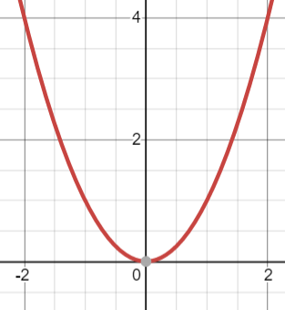

# Big-O Notation

## Introduction
Big-O is a common and widely used term to determine the **performance** of our code. We can use this for measuring *space* (the amount of physical space on the computer) and *time* (the length of time it takes for the program to complete). In this module, and all following modules, we will only focus on the *time* aspect.

When we say time, we're not talking Back to the Future. We mean the amount of time that a particular line, or entire program would take to fully finish what was programmed.

## What is Big-O and How to Use it

Like state previously, when we say Big-O, we mean performance, so keep that in mind.

An example of Big-O would be O(n). Where O is the performance itself, and anything with the parenthesis is the level or speed of performance. This is the same thing as mathmatical expressions such as `y=x`, as shown in the picture below.


We know this expression to be a linear graph. In our case, to write `y=x` in Big-O, we would say O(n) where n is the number of input.

To phrase it differently, ***n*** is a ***linear increase***. As we will look at below, if you are in a loop, ***n is the length of a list*** for example.

That means, in our code, the more work the program has to do, it will take an equal amount of time to complete.

This isn't the best in terms of performance, but it's not the worst either.
The best is O(1) meaning that no matter what, it is a ***constant*** performance. Mathmatically, that could be y=1, shown below.


There are other Big-O performances, such as O(n^2), O(log n), O(n log n), and a few others. If you really want to understand these more, I would recommend going to this link: [Big-O in-depth explanation](https://www.freecodecamp.org/news/big-o-notation-why-it-matters-and-why-it-doesnt-1674cfa8a23c/)

## Programming Examples with Explanations
Now all of this information is great and all, how would you recognize this in your code? Below we will go over examples that are common.

Eariler we mentioned that O(1) is the fastest level of performance. But, what does that look like in code? It looks like this:
```python
    x = 5
```

That's right! Anytime you define a variable, or make a function call, that is O(1)!

To look at other examples in code, let's look at loops. Do you know how fast a for loop is? Well, what is it doing? It's meant to look at every single thing within a certain range or length, right?
That's O(n) and in code would look something like this:
```python
for list in range(lists):
    print("I'm in a list!")
```
What if you have two different for loops consecutive of each other and not nested like this:
```python
    for list in range(my_list):
        print('List 1!')

    for l in range(new_list):
        print('List 2!') 
```
Because these would fire the first then the second, it is still O(n)! However, once it because a nested loop, or a loop within a loop, the performance changes dramatically:
```python
    for list in range(my_list):
        for l in range(new_list):
            print("There's 2 of me!") 
```
This code is O(n^2) because it will loop through the first list one time, then go to the second, but it will iterate for as long as the new_list is, then go back to the outer loop, iterate making it the second time, then so on and so forth ***until the outer loop has reached the length of the list***.

To help you understand, take a look at the following graph examples:

This is O(n):


This is O(n^2):



Look at the difference! Obviously, this performance is unacceptable.

There are ways to remidy a nested loop, or even a normal loop. We will cover these said fixes as the course goes on.

## Conclusion

Now that you have a basic understanding of Big-O, you should understand why it is we use it, and why it's important to know how to identify the different levels of performance so that we can make our programs as efficient as possible.

I will emphasize that it is important that you understand these concepts since later as part of the assignments, I will ask that you identify the Big-O notation.

If you need any help fully understanding this or any future concepts, please email me and we can work together to ensure that you understand.